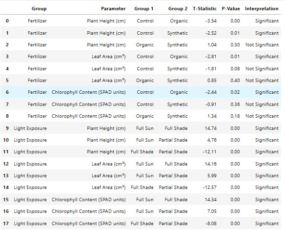
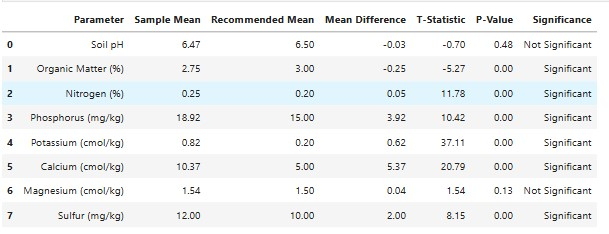

# **ttest-python-implementation**

## **Overview**

This project provides a comprehensive implementation of Student’s *t*-tests using Python. It focuses on statistical hypothesis testing for comparing means across one or more groups, using common t-test methods: **one-sample**, **independent two-sample**, and **paired-sample t-tests**. The goal is to offer clean, readable Python code that can be adapted for educational purposes, research, or data analysis tasks.

The implementation also includes support for analyzing multiple parameters across multiple groups. All test outputs are formatted into structured **DataFrames** for clarity, and each result includes interpretation to help users draw meaningful conclusions from their data.

---

## **Goals**

* Implement **t-tests** in Python using real and simulated data.
* Support analysis across **multiple numerical parameters** and **group comparisons**.
* Present results in a **structured DataFrame format**.
* Automatically generate **interpretations** based on p-values and test statistics.
* Ensure reproducibility, readability, and flexibility for adaptation.

---

## **Implemented Features**

* **One-sample t-test**: Compares the mean of a sample to a known population mean.
* **Independent two-sample t-test**: Compares the means of two independent groups.
* **Paired sample t-test**: Compares means from the same group at different times or under two conditions.
* **Multi-variable Support**: Automatically applies t-tests across multiple columns of numerical data.
* **Grouped Analysis**: Supports t-tests for grouped data (e.g., comparing treatment vs. control).
* **Result Formatting**: Output includes test statistic, degrees of freedom, p-value, mean difference, and interpretation, all neatly structured in a **Pandas DataFrame**.
* **Automatic Interpretation**: Clear, concise interpretations based on standard alpha levels (e.g., 0.05).
* **Edge Case Handling**: Includes checks for unequal variances and small sample sizes.

---

## **Example Use Case**

Suppose you want to test whether several physiological parameters differ significantly between two treatment groups. You can feed your dataset into the script, and it will return:

* Which variables show statistically significant differences.
* The p-values and test statistics.
* A clear explanation of the result in plain language (e.g., "There is no significant difference in blood pressure between Group A and Group B").

---

## **Sample Output Format**

The results are returned in a DataFrame like this:

1.0. *Independent T-test Results*




2.0. *Paired Sample T-test Results*


3.0. *One Sample T-test Results*


---

## **Technologies Used**

* **Python 3.8+**
* **Pandas** – For data handling and formatting.
* **SciPy (stats)** – For statistical test calculations.
* **NumPy** – For numerical operations.
* **Jupyter Notebook** – For demonstrations and visualizations (optional).

---

## **Project Structure**

```
ttest-python-implementation/
├── ttest_analysis.py      # Main script for t-test execution
├── ttest_utils.py            # Helper functions and statistical logic
├── example_data.csv          # Sample dataset for demonstration
├── ttest_report.ipynb        # Jupyter notebook for exploratory testing
└── README.md                 # Project overview and instructions
```

---

## **How to Use**

1. Clone the repository:

   ```bash
   git clone https://github.com/yourusername/ttest-python-implementation.git
   cd ttest-python-implementation
   ```

2. Install dependencies:

   ```bash
   pip install pandas scipy numpy
   ```

3. Prepare your data in a CSV or DataFrame format:

   * Ensure you have one or more **numeric parameters**.
   * Have at least one **categorical grouping column** (e.g., "treatment").

4. Run the analysis:

   ```python
   from ttest_analysis import perform_ttests

   result_df = perform_ttests(data=df, group_col='treatment', param_cols=['bp', 'hr'])
   print(result_df)
   ```

---

## **Interpretation Guidelines**

* **p-value < 0.05**: There is a statistically significant difference between groups.
* **p-value ≥ 0.05**: There is no statistically significant difference.
* Always consider **effect size** and **sample size** along with p-values to draw meaningful conclusions.

---

## **Contributing**

Contributions are welcome! If you have ideas for enhancements (e.g., adding ANOVA or visualizations), feel free to open an issue or submit a pull request.

---

## **License**

This project is licensed under the MIT License – feel free to use, modify, and share.
